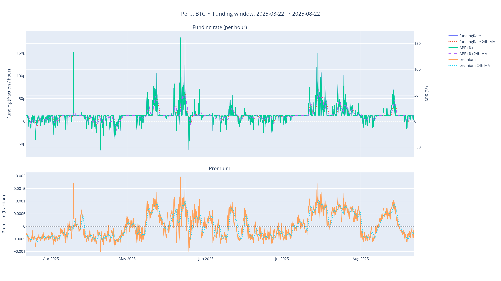

## Hyperliquid Perpetual Contracts Historical Funding Rate Data Collection and Processing Report

Report date: September 12, 2025

Author: Ernest

---

### 1. Summary

To support our AI trading Agent project, and to build richer market state representations for our reinforcement learning models, we created an hourly funding rate dataset for Hyperliquid perpetual contracts that aligns with OHLCV price data. Funding rate is a core mechanism for perpetual contracts. It directly affects carrying cost, reflects market long/short sentiment, and is an essential factor for advanced quantitative strategies.

The main challenges came from interacting with the live API: strict rate limits, network interruptions, and occasional server-side errors (HTTP 5xx). To handle these, we built a robust multi-threaded downloader with a global token-bucket rate limiter, exponential backoff with jitter for retries, checkpointing for resume, and configurable error strategies.

We successfully collected and processed hourly funding rate history for 191 perpetual contracts and stored them in efficient Parquet files. This dataset supplies our AI Agent with key cost and sentiment features, linking price microstructure to broader market state.

---

### 2. Introduction & Motivation

Price data (OHLCV) shows only part of market behavior for perpetual contracts. The funding rate keeps contract prices tied to spot price by requiring periodic payments between longs and shorts.

- How it affects strategies:
  
    1. **Carrying cost**: A positive funding rate means longs pay shorts; a negative rate means shorts pay longs. Funding directly changes the carrying cost or return of a position, so any long-horizon strategy must include it.
       
    2. **Market sentiment indicator**: Persistent positive funding often signals heavy leveraged long positioning; persistent negative funding indicates short dominance. It can serve as a useful sentiment factor or mean-reversion signal.
       

For our pair-trading and reinforcement learning agents, funding rate is both a component of reward calculation and a feature in the state space that price data alone cannot replace. Building a clean, complete funding-rate dataset that aligns with price bars is therefore essential.

---

### 3. Data Source & Core Challenges

#### 3.1. Data source overview

- **API endpoint**: Funding history is fetched from Hyperliquid via `POST https://api.hyperliquid.xyz/info` with `{"type":"fundingHistory", ...}` requests.
  
- **Granularity**: The API exposes hourly funding history.
  
- **Record fields**: Each item includes a timestamp (`time`), `fundingRate`, and `premium`.
  

#### 3.2. Core challenges

Unlike offline raw files, calling a live API brings new issues:

- **Challenge 1: API limits and instability**
  
    - **Rate limits**: The API enforces strict request frequency; too many calls cause `HTTP 429 (Too Many Requests)`.
      
    - **Server errors**: When fetching large ranges over long runs, `HTTP 5xx` errors occur and can make certain time windows unavailable.
    
- **Challenge 2: Fault tolerance for long runs**
  
    - Downloading months of hourly data for nearly 200 contracts can take hours. Network drops or a script crash can otherwise force a full restart.
    
- **Challenge 3: Data consistency**
  
    - User input like `btc` may not match the exchange canonical name `BTC`. Requests must use the exchange official names to avoid failures.
      

---

### 4. Data Pipeline Design & Implementation

We implemented a funding downloader with several industrial-strength reliability features.

#### 4.1. Robust API layer

- **Global rate control**: The script includes a `TokenBucket` class to enforce a shared rate limit across threads (for example, 0.5 req/s). Threads must take a token before calling the API, preventing `429` errors.
  
- **Smart retries**: The `post_info` wrapper uses exponential backoff with random jitter for network and `5xx` errors, raising the final success rate.
  

#### 4.2. Checkpointing and resume

- **Checkpoint files**: For each coin in progress, the script writes a `.partial.parquet` in `tmp/` with the data already fetched.
  
- **Resume**: On restart the script reads any partial file, finds the last timestamp, and requests only subsequent data. This prevents lost progress on long tasks.
  

#### 4.3. Time-window splitting and flexible 500 handling

Hyperliquid will reject very large time ranges for hourly data. Instead of fetching one giant range, the script splits the range into multiple smaller windows and requests them sequentially. This is controlled by `--hours-per-window` (default `14*24`, i.e., 14 days).

Sometimes an API server will fail for a specific window (for example, data around May 15). When a `HTTP 500` occurs, the script accepts different handling modes via `--on-500`:

- **`empty` (default)**: Treat the failed window as empty and continue. This avoids stopping the whole coin while still getting other windows.
  
- **`split`**: Recursively split the failing window into smaller parts and retry until success or minimum window size.
  
- **`skip-coin`**: Abandon the coin if any window fails repeatedly, on the assumption the coin source is unreliable.
  

We use `empty` by default to balance stability and data coverage. It prevents a single window failure from blocking the rest of the download.

#### 4.4. Canonicalizing asset names

Before downloads, the script queries `/info` with `type: "meta"` to fetch the official list of perpetual contract names. The `canonicalize_list` function maps user input (case-insensitive) to these official names so all requests use the correct names.

---

### 5. Final Dataset Specification

#### 5.1. Storage layout

Funding files are stored in a separate directory alongside OHLCV:

```
./hyperliquid_funding/
├── <COIN>_funding_<YYYY-MM-DD>_<YYYY-MM-DD>.parquet
├── BTC_funding_2025-03-22_2025-08-22.parquet
└── ETH_funding_2025-03-22_2025-08-22.parquet
... (191 files)
```

#### 5.2. Data dictionary

All Parquet files contain these columns:

| Column        |                  Type | Unit     | Description                                                  |
| ------------- | --------------------: | -------- | ------------------------------------------------------------ |
| `time`        | `datetime64[ns, UTC]` | UTC time | The hourly timestamp when funding takes effect.              |
| `coin`        |            `category` | N/A      | Canonical asset name, e.g., "BTC".                           |
| `fundingRate` |             `float64` | fraction | The **hourly** funding rate. Positive means longs pay shorts. |
| `premium`     |             `float64` | fraction | The premium component of funding rate.                       |

---

### 6. Visual Exploratory Data Analysis

We validated the dataset with visual checks to assess quality, find patterns, and provide initial insights for downstream models. We built `plot_funding.py` to plot any contract’s funding history as an interactive chart.

#### 6.1. Tools and methods

`plot_funding.py` uses `pandas` for processing and `plotly` for plotting. Main features:

- **Dual-axis chart**: funding rate (left axis, fraction/hour) and an approximate annualized APR (right axis, percent).
  
- **Component plot**: funding rate versus premium to see what drives funding swings.
  
- **Moving averages**: optional 24-hour MA to smooth noise and reveal mid-term trends.
  
- **Batch mode**: generate charts for all assets in the output directory.
  

#### 6.2. Case study: BTC perpetual funding rate

BTC is central to market behavior. Below is an example chart for BTC funding (2025-03-22 → 2025-08-22).  


##### 6.2.1 Concepts and formulas

- **fundingRate (fraction/hour)**: The hourly proportion paid or received on the notional position.  
$$
payment = position_size \times oracle_price × fundingRate $$(when fundingRate is positive, longs pay).

- **APR rough conversion**: 
$$
APR(\%) = \text{fundingRate}\times 24\times 365\times 100
$$
This is for scale intuition; true annual cost depends on the path over time.

- **premium**: 
$$
\text{premium} = \frac{\text{impact price difference}}{\text{oracle price}}
$$
Intuition: if perpetual is priced above spot (premium>0), funding tends to be positive.

- **Settlement frequency**: funding settles **hourly** (the 8-hour formula is split into hourly payments).
  
- **Caps**: Hourly funding has caps; extreme values are rare but possible and are limited by caps.
  

##### 6.2.2 Top subplot: Funding rate (hourly)

- **Left axis — Funding (fraction / hour)**: hourly rate, e.g., 20 µ = 20×10⁻⁶ = 0.000020/hour = 0.002%/hour.
  
- **Right axis — APR (%)**: the hourly rate converted to annual percentage using the formula above.
  
- **fundingRate (solid)**: the hourly funding from the API; positive = longs pay, negative = shorts pay.
  
- **fundingRate 24h MA (dashed)**: 24-hour simple moving average to reduce noise.
  
- **APR and APR 24h MA**: the same lines converted to percent on the right axis.
  

> The black dashed line at 0 separates longs-paying (above) from shorts-paying (below).

##### 6.2.3 Bottom subplot: Premium

- **Axis — Premium (fraction)**: premium as a fraction, not percent. For example, 0.001 = 0.1% premium.
  
- **premium (solid)**: the hourly average premium returned by the API (API samples every 5 seconds and averages).
  
- **premium 24h MA (dashed)**: the 24-hour moving average of premium.
  

> **Relation**: premium measures how contract price deviates from spot and drives funding direction and strength: positive premium → longs willing to pay → positive funding; negative premium → opposite.

---

##### 6.2.4 Interpreting the BTC chart

- **Data quality**: BTC funding is continuous and complete over the five-month window, with ranges and volatility matching expectations for a high-liquidity asset. This confirms the downloader’s reliability for core assets.
  
- **High-frequency, two-sided swings**:
  
    - BTC shows frequent, symmetric swings between positive and negative funding. Peaks on both sides are notable.
      
    - **Interpretation**: This is typical for a liquid market where long and short leverage alternate quickly. Large speculative runs are often trimmed by quick arbitrage, unlike some altcoins that may see long single-direction runs driven by narratives.
    
- **Market regimes**:
  
    - **April to mid-May**: dominated by negative funding, implying shorts paid longs. This suggests a cautious or hedging-biased market.
      
    - **Late May to June**: highest volatility phase with sharp positive spikes (APR briefly over 150%) followed by deep negative rebounds. This marks a highly speculative and uncertain period with strong long-short battles.
      
    - **July to August**: more normal but slightly positive funding, indicating modest warming in sentiment while two-sided trading continues.
    
- **Implications for algorithms**:
  
    - **Pair trading**: BTC funding’s high-frequency mean-reverting nature makes it a candidate factor. It can also act as a market-state filter: for example, enable certain pair rules only when BTC funding is negative (market cautious).
      
    - **Reinforcement learning Agent**: funding dynamics give rich state signals. Agents can learn to treat sustained positive funding as a sign of leveraged long risk and reduce long exposure. The funding rate change (first derivative) is a useful momentum feature. During the May–June extremes, agents must manage large potential carrying costs, which tests risk controls.
      

**Conclusion**: Visual analysis of BTC funding confirms data quality and reveals dynamic microstructure patterns. These findings feed into state-feature design and scenario-aware trading rules for both pair trading and reinforcement learning.

---

### 7. Usage Guide & Code Examples

#### 7.1. Load a single asset funding file quickly

```python
import pandas as pd

# Load BTC funding data
df_funding_btc = pd.read_parquet('./hyperliquid_funding/BTC_funding_2025-03-22_2025-08-22.parquet')

print("BTC Hourly Funding Rate data:")
print(df_funding_btc.head())
```

#### 7.2. Core use: merge OHLCV with funding

OHLCV timestamps mark bar start, while funding is effective on the hour. Use `pandas.merge_asof` to align the datasets.

```python
import pandas as pd

def merge_ohlcv_with_funding(ohlcv_df: pd.DataFrame, funding_df: pd.DataFrame) -> pd.DataFrame:
    """
    Align OHLCV bars with funding rate records.

    For each OHLCV bar, match the latest funding record that took effect
    at or before the bar start time.
    """
    # Ensure both time indices are UTC
    ohlcv_df.index = pd.to_datetime(ohlcv_df.index, utc=True)
    funding_df.index = pd.to_datetime(funding_df.index, utc=True)
    
    # Use merge_asof for forward alignment
    merged_df = pd.merge_asof(
        left=ohlcv_df,
        right=funding_df[['fundingRate']], # only merge fundingRate column
        left_index=True,
        right_index=True,
        direction='forward' # find the next FR then shift back by one row
    )
    # fundingRate usually takes effect at the next bar, so shift back one row
    merged_df['fundingRate'] = merged_df['fundingRate'].shift(1)
    
    return merged_df

# Example: merge BTC 1-hour OHLCV with funding
df_ohlcv_btc = pd.read_parquet('./hyperliquid_data/processed_ohlcv_1h/perp/BTC_1h_ohlcv.parquet')
df_funding_btc = pd.read_parquet('./hyperliquid_funding/BTC_funding_2025-03-22_2025-08-22.parquet')

df_combined = merge_ohlcv_with_funding(df_ohlcv_btc, df_funding_btc)

print("\nCombined OHLCV and Funding Rate data for BTC:")
# Show the last rows to see the fundingRate column
print(df_combined.tail())
```

---

### 8. Scope and Limitations

- **Time granularity**: The dataset is hourly and is not suitable for minute-level funding-arbitrage strategies.
  
- **Funding components**: We store total funding (`fundingRate`) and its main component `premium`. The interest-rate component alone is not separated. In most cases, premium drives funding.
  
- **Availability**: The earliest available date in our dataset is 2025-03-22, matching the project source data range.
  

---

### 9. Future Maintenance & Extensions

- **Updates**: Run the downloader regularly. Checkpointing makes incremental updates efficient.
  
- **Extensions**: Consider adding more Level-3 market signals such as open interest to build a more complete market-state vector.
  

---

### 10. Appendix

- **Appendix A**: Core downloader script (full code provided)
  
- **Appendix B**: `requirements.txt` and environment details